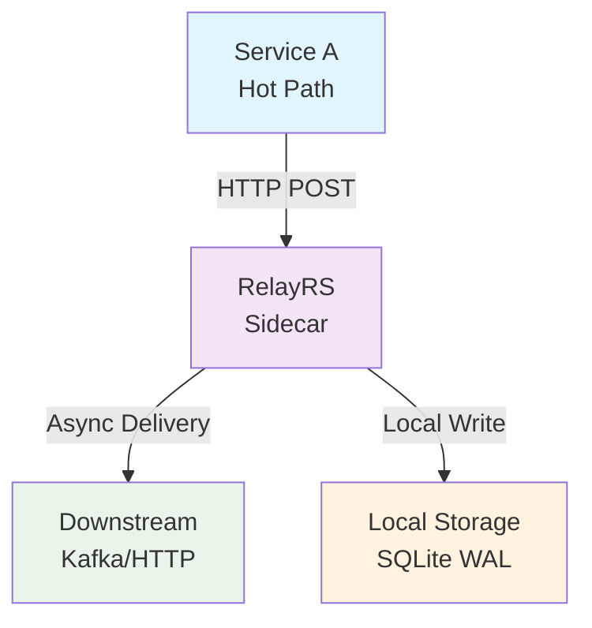
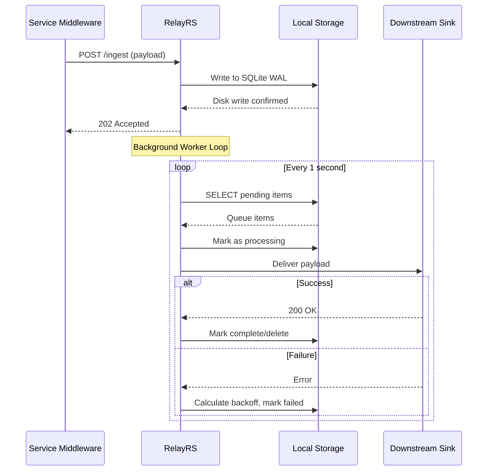
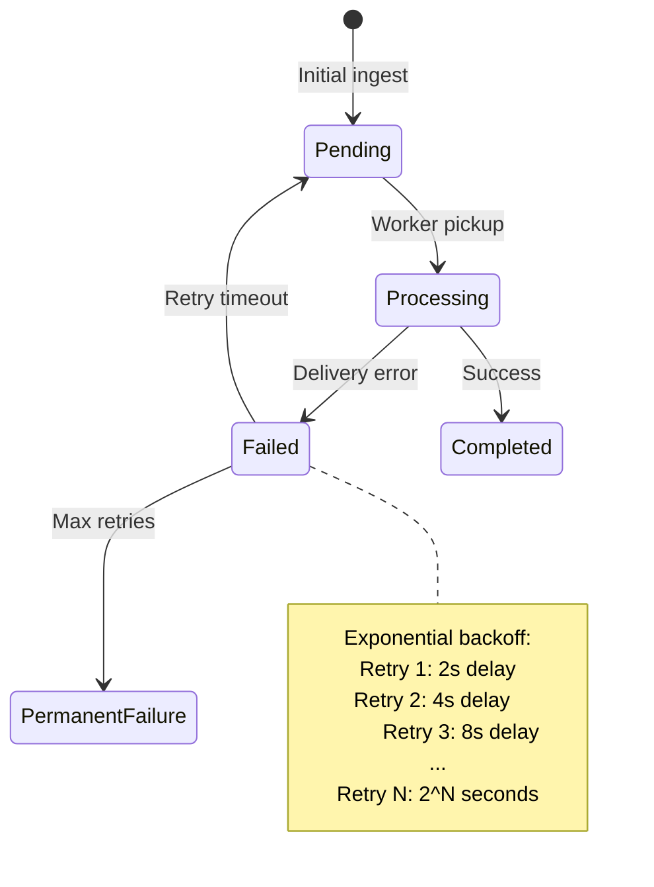

# RelayRS High-Level Design (HLD)

## 1. System Context

RelayRS operates as a **resilient edge buffer sidecar** within microservices ecosystems, implementing the Transactional Outbox pattern to ensure zero data loss during service-to-service communication and downstream processing failures.

### 1.1 Architectural Position

### 1.2 Core Responsibilities

- **Data Ingestion**: Accept telemetry via HTTP POST with immediate acknowledgment
- **Durable Buffering**: Persist all data to local storage before acknowledgment
- **Reliable Delivery**: Ensure eventual delivery to downstream systems
- **Failure Recovery**: Handle network partitions and downstream outages transparently
- **Backpressure Management**: Protect services from overwhelming downstream systems

---

## 2. High-Level Flow

### 2.1 High-Level Flow Sequence

---

## 3. Core Design Pillars

### 3.1 Transactional Durability

> [!NOTE] **ACID Guarantees with SQLite WAL**
> 
> RelayRS uses SQLite in WAL (Write-Ahead Logging) mode to provide ACID guarantees while maintaining high concurrency for read operations during ingestion.

**Key Principles:**
- **Write-Ahead Persistence**: All data is persisted to disk before HTTP acknowledgment
- **Atomic Operations**: Queue state transitions are atomic and crash-resistant
- **Isolation**: Concurrent reads don't block writes, enabling high-throughput ingestion
- **Durability**: Data survives process crashes and system restarts

### 3.2 Backpressure Management

> [!IMPORTANT] **Capacity-Based Flow Control**
> 
> The system enforces hard limits to prevent memory exhaustion and maintain predictable performance.

**Mechanisms:**
- **Queue Depth Limits**: `MAX_ENTRIES` prevents unbounded memory growth
- **HTTP 507 Responses**: Immediate feedback when capacity is exceeded
- **Storage Size Limits**: `MAX_SIZE_MB` prevents disk exhaustion
- **TTL-Based Pruning**: Automatic cleanup of old completed entries

### 3.3 Pluggable Architecture

> [!NOTE] **Trait-Based Extensibility**
> 
> The `DeliverySink` trait enables runtime selection of downstream destinations without code changes.

**Supported Sinks:**
- **HttpSink**: Standard REST API endpoints and webhooks
- **KafkaSink**: High-throughput distributed message streaming
- **StdoutSink**: Local development and debugging

---

## 4. Failure Modes & Recovery

### 4.1 Sink Downtime Handling

**Recovery Strategy:**
1. **Immediate Retry**: For transient network issues
2. **Exponential Backoff**: Prevent cascade failures
3. **Permanent Failure**: Mark items after `MAX_RETRIES` exceeded
4. **Zombie Recovery**: Detect and recover stuck "processing" items

### 4.2 Local Storage Saturation

**Saturation Scenarios:**
- **Disk Full**: System returns HTTP 507 for new requests
- **Queue Depth Exceeded**: Backpressure applied before memory exhaustion
- **TTL Expiration**: Automatic pruning of old completed entries

**Recovery Actions:**
1. **Aggressive Pruning**: Remove old completed entries
2. **Size-Based Cleanup**: Delete oldest entries when size limits exceeded
3. **Zombie Recovery**: Reset items stuck >1 hour in "processing" state

---

## 5. System Boundaries & Interfaces

### 5.1 External Interfaces

| Interface | Protocol | Purpose | SLA |
|-----------|----------|---------|-----|
| `POST /ingest` | HTTP JSON | Data ingestion | <10ms latency |
| `GET /health` | HTTP JSON | Health monitoring | Real-time |
| `GET /stats` | HTTP JSON | Queue metrics | Real-time |
| `GET /metrics` | HTTP Text | Prometheus metrics | Real-time |

### 5.2 Internal Interfaces

| Component | Interface | Data Flow |
|-----------|-----------|-----------|
| Ingestor → Storage | StorageEngine trait | Write operations |
| Worker → Storage | StorageEngine trait | Read/Update operations |
| Worker → Sink | DeliverySink trait | Payload delivery |
| Config Sync → All | Shared state | Dynamic configuration |

---

## 6. Operational Considerations

### 6.1 Deployment Patterns

**Sidecar Pattern (Recommended):**
- Co-located with application service
- Localhost communication for minimal latency
- Shared lifecycle with parent service

**Centralized Hub Pattern:**
- Single instance serving multiple services
- Network-based communication
- Centralized observability and management

### 6.2 Observability

**Built-in Metrics:**
- Queue depth by status (pending, processing, failed)
- Storage utilization (size, entry count)
- Delivery success/failure rates
- Retry distribution and backoff timing

**Logging Strategy:**
- Structured JSON logging for machine processing
- Correlation IDs for request tracing
- Error categorization for alerting

---

## 7. Scalability & Performance

### 7.1 Throughput Characteristics

- **Ingestion**: Limited by SQLite WAL write performance (~10k ops/sec)
- **Processing**: Limited by downstream sink capacity
- **Storage**: Limited by disk I/O and available space
- **Memory**: Bounded by queue depth limits

### 7.2 Concurrency Model

- **Ingestion Path**: Single-threaded SQLite writes (atomic)
- **Processing Path**: Single worker thread (sequential processing)
- **Background Tasks**: Separate tasks for pruning and config sync
- **State Sharing**: Arc<RwLock<T>> for thread-safe configuration

---

*This HLD serves as the architectural foundation for RelayRS, ensuring clarity of design principles and system behavior for both implementation and operational teams.*
