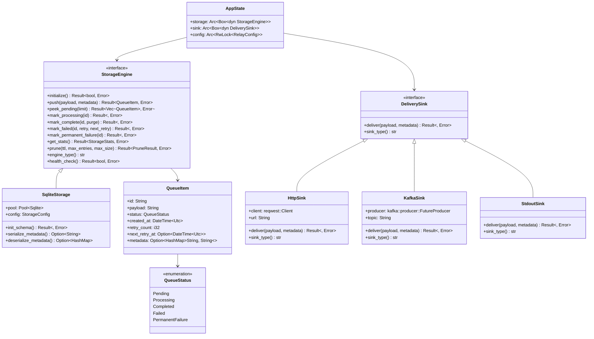

# RelayRS Low-Level Design (LLD)

## 1. Component Breakdown

### 1.1 Ingestor (Axum HTTP Server)

**File:** `src/main.rs` (lines 172-183)

```rust
let app = Router::new()
    .route("/health", get(health_check))
    .route("/ingest", post(ingest_endpoint))
    .route("/stats", get(get_stats))
    .route("/metrics", get(metrics_endpoint))
    .with_state(state);
```

**Key Responsibilities:**
- **Request Validation**: JSON schema validation for inbound payloads
- **Capacity Checking**: Pre-write queue depth validation (line 217)
- **Immediate Persistence**: Synchronous storage write before acknowledgment
- **Error Handling**: Proper HTTP status codes (202, 507, 500)

**Critical Path:**
```rust
// Check queue capacity before enqueuing
let stats = state.storage.get_stats().await?;
if stats.total_entries >= config.storage.max_entries as i64 {
    return Err(StatusCode::INSUFFICIENT_STORAGE);
}

// Atomic write to storage
let queue_item = state.storage.push(payload_str, metadata_map).await?;
```

### 1.2 StorageEngine (Trait-Based Abstraction)

**File:** `src/storage/mod.rs` (lines 53-87)

```rust
#[async_trait]
pub trait StorageEngine: Send + Sync {
    async fn initialize(&mut self) -> Result<(), anyhow::Error>;
    async fn push(&self, payload: String, metadata: Option<HashMap<String, String>>) -> Result<QueueItem, anyhow::Error>;
    async fn peek_pending(&self, limit: usize) -> Result<Vec<QueueItem>, anyhow::Error>;
    async fn mark_processing(&self, id: &str) -> Result<(), anyhow::Error>;
    async fn mark_complete(&self, id: &str, success_purge: bool) -> Result<(), anyhow::Error>;
    async fn mark_failed(&self, id: &str, retry_count: i32, next_retry_at: DateTime<Utc>) -> Result<(), anyhow::Error>;
    async fn mark_permanent_failure(&self, id: &str) -> Result<(), anyhow::Error>;
    async fn get_stats(&self) -> Result<StorageStats, anyhow::Error>;
    async fn prune(&self, ttl_hours: u32, max_entries: usize, max_size_mb: u64) -> Result<PruneResult, anyhow::Error>;
    fn engine_type(&self) -> &'static str;
    async fn health_check(&self) -> Result<bool, anyhow::Error>;
}
```

**SQLite Implementation Details:**
- **WAL Mode**: `PRAGMA journal_mode = WAL;` for concurrent reads
- **Connection Pool**: `sqlx::SqlitePool` for connection reuse
- **Schema**: Indexed queue_items table for efficient queries

### 1.3 Dispatcher (Worker Loop)

**File:** `src/main.rs` (lines 293-335)

```rust
async fn worker_task(state: AppState) {
    let config = state.config.read().await.clone();
    let mut interval = interval(Duration::from_secs(config.worker.poll_interval_seconds));
    
    loop {
        tokio::select! {
            _ = interval.tick() => {
                match process_pending_items(&state.storage, &state.sink, &config).await {
                    Ok(count) => {
                        if count > 0 {
                            info!("Processed {} pending items", count);
                        }
                    }
                    Err(e) => {
                        error!("Error processing pending items: {}", e);
                    }
                }
            }
            _ = prune_interval.tick() => {
                // Background cleanup task
            }
        }
    }
}
```

**Processing Logic:**
1. **Batch Selection**: Fetch up to `batch_size` pending items
2. **State Transition**: Mark items as "processing" to prevent duplicate work
3. **Delivery Attempt**: Send payload to configured sink
4. **Result Handling**: Update status based on delivery outcome

---

## 2. Detailed Component Relationships

### 2.1 Mermaid Class Diagram



---

## 3. Concurrency Model

### 3.1 Thread-Safe Trait Objects

**Pattern:** `Arc<Box<dyn Trait>>`

```rust
#[derive(Clone)]
struct AppState {
    storage: Arc<Box<dyn StorageEngine>>,
    sink: Arc<Box<dyn DeliverySink>>,
    config: Arc<tokio::sync::RwLock<RelayConfig>>,
}
```

**Rationale:**
- **Arc**: Reference counting for shared ownership across threads
- **Box**: Dynamic dispatch for runtime polymorphism
- **dyn Trait**: Enables pluggable implementations without recompilation

### 3.2 Background Task Spawning

**File:** `src/main.rs` (lines 163-169)

```rust
// Spawn background tasks
let worker_state = state.clone();
let config_sync_state = state.clone();

tokio::spawn(async move {
    worker_task(worker_state).await;
});

tokio::spawn(async move {
    config_sync_task(config_sync_state).await;
});
```

**Task Responsibilities:**
1. **Worker Task**: Queue processing and delivery
2. **Config Sync Task**: Dynamic configuration updates
3. **Pruning Task**: Storage cleanup and maintenance

---

## 4. Retry Logic Implementation

### 4.1 Exponential Backoff Algorithm

**File:** `src/main.rs` (lines 367-374)

```rust
// Calculate exponential backoff
let delay_seconds = config.network.retry_backoff_sec * 2_u64.pow(retry_count as u32 - 1);
let next_retry_at = Utc::now() + chrono::Duration::seconds(delay_seconds as i64);

storage.mark_failed(&item.id, retry_count, next_retry_at).await?;
```

**Algorithm Details:**
- **Base Delay**: `retry_backoff_sec` (default: 2 seconds)
- **Exponential Factor**: `2^(retry_count - 1)`
- **Maximum Retries**: `max_retries` (default: 5)
- **Timing Calculation**: `next_retry_at = now + delay`

**Retry Schedule Example:**
```
Retry 1: 2s delay (2^1 * 1s)
Retry 2: 4s delay (2^2 * 1s)  
Retry 3: 8s delay (2^3 * 1s)
Retry 4: 16s delay (2^4 * 1s)
Retry 5: 32s delay (2^5 * 1s)
```

### 4.2 Zombie Recovery Strategy

**File:** `src/storage/sqlite.rs` (lines 293-304)

```rust
// Fix zombie processing items (items stuck in 'processing' for > 1 hour)
let zombie_cutoff = Utc::now() - Duration::hours(1);
let zombie_result = sqlx::query(
    "UPDATE queue_items SET status = 'pending' WHERE status = 'processing' AND created_at < ?1"
)
.bind(zombie_cutoff)
.execute(self.get_pool())
.await?;

if zombie_result.rows_affected() > 0 {
    warn!("Recovered {} zombie processing items", zombie_result.rows_affected());
}
```

**Recovery Logic:**
- **Detection**: Items in "processing" state > 1 hour
- **Action**: Reset to "pending" for reprocessing
- **Frequency**: Every 10 minutes (batch_prune_interval_sec)
- **Logging**: Warning level for operational visibility

---

## 5. Database Schema

### 5.1 SQLite Table Structure

**File:** `src/storage/sqlite.rs` (lines 30-45)

```sql
CREATE TABLE IF NOT EXISTS queue_items (
    id TEXT PRIMARY KEY,                    -- UUID v4
    payload TEXT NOT NULL,                  -- JSON payload
    status TEXT NOT NULL DEFAULT 'pending', -- Queue status
    retry_count INTEGER NOT NULL DEFAULT 0, -- Retry attempts
    created_at DATETIME NOT NULL DEFAULT CURRENT_TIMESTAMP,
    next_retry_at DATETIME,                 -- Scheduled retry time
    metadata TEXT                           -- JSON metadata
);

-- Performance indexes
CREATE INDEX IF NOT EXISTS idx_queue_status ON queue_items(status);
CREATE INDEX IF NOT EXISTS idx_queue_next_retry ON queue_items(next_retry_at);
CREATE INDEX IF NOT EXISTS idx_queue_created_at ON queue_items(created_at);
```

### 5.2 Query Optimization

**Pending Items Query:**
```sql
SELECT id, payload, status, created_at, retry_count, next_retry_at, metadata
FROM queue_items
WHERE status = 'pending' 
   OR (status = 'failed' AND next_retry_at <= ?1)
ORDER BY created_at ASC
LIMIT ?2
```

**Statistics Query:**
```sql
SELECT 
    COUNT(*) as total,
    COUNT(CASE WHEN status = 'pending' THEN 1 END) as pending,
    COUNT(CASE WHEN status = 'processing' THEN 1 END) as processing,
    COUNT(CASE WHEN status = 'completed' THEN 1 END) as completed,
    COUNT(CASE WHEN status = 'failed' THEN 1 END) as failed,
    COUNT(CASE WHEN status = 'permanent_failure' THEN 1 END) as permanent_failure
FROM queue_items
```

---

## 6. Configuration Management

### 6.1 Configuration Structure

**File:** `src/main.rs` (lines 29-58)

```rust
#[derive(Debug, Clone, Serialize, Deserialize)]
struct RelayConfig {
    storage: StorageConfig,
    network: NetworkConfig,
    worker: WorkerConfig,
    sink: SinkConfig,
}
```

### 6.2 Environment Variable Mapping

**Storage Configuration:**
```rust
impl Default for StorageConfig {
    fn default() -> Self {
        Self {
            max_entries: std::env::var("STORAGE_MAX_ENTRIES")
                .unwrap_or_else(|_| "50000".to_string())
                .parse()
                .unwrap_or(50000),
            max_size_mb: std::env::var("STORAGE_MAX_SIZE_MB")
                .unwrap_or_else(|_| "500".to_string())
                .parse()
                .unwrap_or(500),
            ttl_hours: std::env::var("STORAGE_TTL_HOURS")
                .unwrap_or_else(|_| "24".to_string())
                .parse()
                .unwrap_or(24),
            // ... other fields
        }
    }
}
```

---

## 7. Error Handling & Observability

### 7.1 Error Classification

**HTTP Error Responses:**
- `202 Accepted`: Successfully queued
- `507 Insufficient Storage`: Queue capacity exceeded
- `400 Bad Request`: Invalid JSON payload
- `500 Internal Server Error`: Storage or processing failure

**Logging Levels:**
- **ERROR**: Delivery failures, storage errors
- **WARN**: Capacity limits, zombie recovery
- **INFO**: Successful operations, configuration changes
- **DEBUG**: Detailed processing information

### 7.2 Metrics Collection

**File:** `src/main.rs` (lines 267-291)

```rust
// Prometheus-compatible metrics
let metrics = format!(
    "# HELP relayrs_total_entries Total number of entries in the queue\n\
     # TYPE relayrs_total_entries gauge\n\
     relayrs_total_entries {}\n\
     # HELP relayrs_pending_entries Number of pending entries\n\
     # TYPE relayrs_pending_entries gauge\n\
     relayrs_pending_entries {}\n\
     # HELP relayrs_failed_entries Number of failed entries\n\
     # TYPE relayrs_failed_entries gauge\n\
     relayrs_failed_entries {}\n",
    stats.total_entries,
    stats.pending_count,
    stats.failed_count
);
```

---

## 8. Performance Considerations

### 8.1 SQLite Optimization

- **WAL Mode**: Enables concurrent reads during writes
- **Connection Pooling**: Reuses database connections
- **Prepared Statements**: Query compilation optimization
- **Batch Operations**: Reduces transaction overhead

### 8.2 Memory Management

- **Bounded Queues**: Fixed limits prevent memory exhaustion
- **Immediate Cleanup**: Delete completed items when `success_purge=true`
- **Metadata Serialization**: JSON for efficient storage/retrieval
- **Arc Reference Counting**: Shared state without duplication

---

*This LLD provides the technical foundation for RelayRS implementation, ensuring consistency between architectural intent and actual code structure.*
